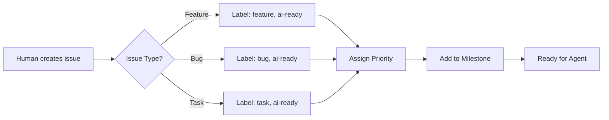

# AI Agents Workflow Documentation

## Overview
This document defines how AI agents collaborate on the Biker Log project using GitHub Issues as the primary coordination mechanism.

## Available AI Agents

### 1. mvp-project-manager
**Purpose**: Manages project scope, prevents feature creep, maintains MVP focus
**Triggers**: 
- New feature requests needing scope evaluation
- Sprint planning sessions
- Backlog grooming
- Risk assessment

### 2. senior-feature-developer
**Purpose**: Implements features with production-quality code
**Triggers**:
- Issues labeled `ai-ready` and `feature`
- Bug fixes labeled `bug` and `ai-ready`
- Technical debt items

### 3. quality-assurance-engineer
**Purpose**: Ensures code quality, test coverage, and reliability
**Triggers**:
- PRs ready for review
- Issues labeled `needs-qa`
- Test coverage reports
- Performance concerns

## Issue-Based Workflow

### 1. Issue Creation Flow


### 2. Agent Selection Pattern
```yaml
if issue.labels contains "ai-ready":
  if issue.labels contains "needs-qa":
    agent = quality-assurance-engineer
  elif issue.labels contains "feature" or "bug":
    agent = senior-feature-developer
  elif issue.labels contains "planning":
    agent = mvp-project-manager
```

### 3. Work Execution Flow
1. **Human**: "Work on issue #5"
2. **Claude**: Reads issue, understands context
3. **Agent**: Executes based on issue type
4. **Claude**: Updates issue with progress
5. **Claude**: Creates PR if code changes
6. **Human**: Reviews and approves

## Label System

### Priority Labels
- `P0-critical`: Must have for MVP (Red)
- `P1-high`: Should have (Orange)
- `P2-medium`: Could have (Yellow)
- `P3-low`: Won't have for MVP 1.0 (Green)

### Size Labels
- `size-S`: < 4 hours
- `size-M`: 4-16 hours
- `size-L`: 16-40 hours
- `size-XL`: > 40 hours

### Status Labels
- `ai-ready`: Agent can work on this
- `in-progress-ai`: Agent currently working
- `needs-human`: Requires human decision
- `needs-qa`: Ready for QA review
- `blocked`: Waiting on dependency

### Category Labels
- `feature`: New functionality
- `bug`: Something broken
- `technical-debt`: Refactoring
- `documentation`: Docs update
- `testing`: Test-related

## Command Patterns

### Basic Commands
```bash
# Work on specific issue
"Work on issue #5"
"Implement the feature described in issue #12"
"Fix the bug in issue #8"

# Batch operations
"Work on all P0 issues"
"Review all issues labeled needs-qa"
"Update all documentation issues"

# Status checks
"What's the status of issue #5?"
"Show me all blocked issues"
"List P0 issues for this sprint"
```

### Advanced Commands
```bash
# Multi-agent coordination
"Use the project manager to review issue #5, then have the developer implement it"
"Get QA review for my recent changes"

# Sprint management
"Plan the next sprint using available issues"
"Which issues should we prioritize?"
"Create issues for the tasks in TASKS.md"
```

## Issue Templates Usage

### Creating a Feature
```markdown
## For AI Agent
**Agent**: senior-feature-developer
**Priority**: P0
**Size**: M
**Sprint**: Sprint 1

## Acceptance Criteria
- [ ] Search bar added to MainActivity
- [ ] Filter by date range works
- [ ] Results update in real-time
```

### Requesting QA
```markdown
## For AI Agent
**Agent**: quality-assurance-engineer
**Type**: Code Review
**Priority**: P1

## Scope of Review
- [ ] Test coverage > 80%
- [ ] Performance benchmarks pass
- [ ] No security issues
```

## Automated Workflows

### On Issue Creation
```yaml
name: Issue Triage
on:
  issues:
    types: [opened]
jobs:
  auto-label:
    - Add size label based on description
    - Add to current milestone
    - Notify in Discord/Slack
```

### On PR Creation
```yaml
name: PR Review
on:
  pull_request:
    types: [opened]
jobs:
  auto-review:
    - Link to related issue
    - Add needs-qa label
    - Run tests
```

## Best Practices

### 1. Issue Hygiene
- One issue = one deliverable
- Clear acceptance criteria
- Proper labels from start
- Link dependencies

### 2. Agent Instructions
- Specify agent explicitly
- Provide constraints
- Define success metrics
- Include examples

### 3. Progress Tracking
- Agents update issue comments
- Use checkboxes for subtasks
- Close issues only when done
- Reference commits/PRs

### 4. Code Quality
- Every feature needs tests
- Documentation updates required
- Performance benchmarks for critical paths
- Security review for data handling

## Example Workflows

### Workflow 1: New Feature Development
```
1. Human: Creates issue using feature template
2. Human: "Work on issue #15"
3. Agent: Reads issue, implements feature
4. Agent: Creates PR with tests
5. Human: "Review the PR for issue #15"
6. QA Agent: Reviews code, suggests improvements
7. Human: Approves and merges
```

### Workflow 2: Bug Fix
```
1. Human: Reports bug in issue
2. Human: "Fix the bug in issue #23"
3. Agent: Investigates, finds root cause
4. Agent: Implements fix with regression test
5. Agent: Updates issue with fix explanation
6. Human: Tests and closes issue
```

### Workflow 3: Sprint Planning
```
1. Human: "Plan sprint 2 with the project manager"
2. PM Agent: Reviews backlog
3. PM Agent: Prioritizes based on dependencies
4. PM Agent: Creates sprint plan
5. Human: "Create issues for sprint 2 tasks"
6. Agent: Creates issues with proper labels
```

## Tips for Effective Agent Use

### Do's
✅ Use specific issue numbers
✅ Provide clear context in issues
✅ Label issues properly
✅ Link related issues
✅ Review agent output
✅ Test agent-generated code

### Don'ts
❌ Vague instructions without issue context
❌ Multiple unrelated tasks in one issue
❌ Skip code review
❌ Ignore test failures
❌ Override agent safety checks

## Metrics and Monitoring

### Track Success
- Issues completed per sprint
- Agent success rate
- Code quality metrics
- Test coverage trends
- Bug escape rate

### Review Regularly
- Weekly: Sprint progress
- Bi-weekly: Agent effectiveness
- Monthly: Process improvements

## Integration with Development Flow

### Git Commit Messages
```
feat(#5): Add search functionality
fix(#23): Resolve CSV header corruption
test(#12): Add integration tests for calibration
docs(#8): Update API documentation
```

### PR Descriptions
```markdown
## Changes
Implements feature described in #5

## Type
- [x] Feature
- [ ] Bug fix
- [ ] Documentation

## Testing
- [x] Unit tests added
- [x] Integration tests pass
- [x] Manual testing done

## Checklist
- [x] Code follows style guide
- [x] Tests pass
- [x] Documentation updated

Closes #5
```

## Troubleshooting

### Common Issues
1. **Agent can't find context**: Ensure issue has clear description
2. **Wrong agent selected**: Check labels are correct
3. **Agent stuck**: Add more specific constraints
4. **Conflicting changes**: Resolve via human review

### Getting Help
- Check this documentation
- Review similar closed issues
- Ask for human assistance
- Escalate to project maintainer

---

*Last Updated: 2025-08-23*
*Version: 1.0.0*