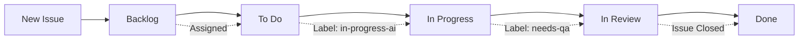
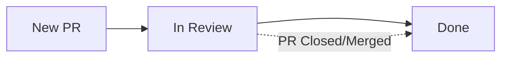

# GitHub Project Board Automation Setup

This document explains the automation setup for the Biker Log GitHub project board, including the workflow rules and configuration process.

## Overview

The project board automation is designed to automatically move issues and pull requests between columns based on specific triggers:

- **New issues** → Backlog column
- **Issues with assignee** → To Do column  
- **Issues labeled 'in-progress-ai'** → In Progress column
- **PRs created** → In Review column
- **Issues labeled 'needs-qa'** → In Review column
- **Closed issues** → Done column

## Project Board Structure

The automation expects the following columns in your GitHub project:

1. **Backlog** - New issues land here automatically
2. **To Do** (or Todo) - Issues move here when assigned
3. **In Progress** - Issues move here when labeled 'in-progress-ai'
4. **In Review** - PRs and issues labeled 'needs-qa' move here
5. **Done** - Closed issues move here

## Setup Process

### Prerequisites

1. **GitHub CLI**: Ensure `gh` is installed and authenticated
2. **Project Scopes**: Your GitHub token needs `read:project` and `project` scopes
3. **Repository Access**: Admin access to the Biker Log repository

### Quick Setup (Recommended)

The automation has been pre-configured! Follow these steps:

1. **Check current status**:
   ```bash
   ./check-automation-status.sh
   ```

2. **Create required labels** (if not already present):
   ```bash
   ./create-labels.sh
   ```

3. **Configure PROJECT_TOKEN secret**:
   - Go to: https://github.com/jeanfbrito/Biker-Log/settings/secrets/actions
   - Create a new secret named `PROJECT_TOKEN`
   - Generate a personal access token with `project` scope
   - Add the token as the secret value

4. **Update project URL** in `.github/workflows/project-automation.yml`:
   - Find your project URL (e.g., `https://github.com/users/jeanfbrito/projects/1`)
   - Replace the placeholder URL in the workflow file

### Advanced Setup (If needed)

If you need to customize the setup, you can run the full setup script:

```bash
./setup-github-project-automation.sh
```

This script will:
1. Check requirements and authentication
2. Find your GitHub project
3. Analyze project structure and fields
4. Create GitHub Actions workflow for automation
5. Display next steps for completion

**Note**: This requires enhanced GitHub token permissions.

## GitHub Actions Workflow

The automation is implemented using GitHub Actions in `.github/workflows/project-automation.yml`. This workflow:

- Triggers on issue and PR events
- Automatically adds new items to the project
- Moves items between columns based on the defined rules

### Required Secrets

Add a `PROJECT_TOKEN` secret to your repository:

1. Go to repository Settings → Secrets and variables → Actions
2. Create a new repository secret named `PROJECT_TOKEN`
3. Generate a personal access token with `project` scope
4. Add the token as the secret value

## Label Requirements

Create these labels in your repository for proper automation:

- `in-progress-ai` - Moves issues to In Progress column
- `needs-qa` - Moves issues to In Review column

## Automation Rules Details

### Issue Lifecycle



### Pull Request Lifecycle



## Troubleshooting

### Common Issues

1. **Permission Errors**
   - Ensure your GitHub token has the required scopes
   - Run the auth refresh command shown above

2. **Project Not Found**
   - Verify the project exists and is linked to the repository
   - Check if the project is in your personal account vs organization

3. **Workflow Not Triggering**
   - Verify the `PROJECT_TOKEN` secret is configured
   - Check the workflow file syntax and project number
   - Ensure labels exist in the repository

### Manual Testing

Test the automation by:
1. Creating a new issue (should go to Backlog)
2. Assigning the issue to someone (should move to To Do)
3. Adding the 'in-progress-ai' label (should move to In Progress)
4. Creating a pull request (should go to In Review)

## Configuration Updates

### Changing Column Names

If your project uses different column names:

1. Update the status field options in your GitHub project
2. Modify the logic in the GitHub Actions workflow file
3. Update the column mappings in the workflow

### Adding New Rules

To add new automation rules:

1. Edit `.github/workflows/project-automation.yml`
2. Add new conditions in the "Move issue to appropriate column" step
3. Create additional workflow jobs if needed

## Monitoring and Maintenance

### Viewing Workflow Runs

Monitor automation in the GitHub Actions tab:
- Go to Actions tab in your repository
- Look for "Project Board Automation" workflow runs
- Check logs for any errors or issues

### Regular Maintenance

- Review automation rules quarterly
- Update token permissions as needed
- Monitor for GitHub API changes that might affect automation

## Additional Resources

- [GitHub Projects Documentation](https://docs.github.com/en/issues/planning-and-tracking-with-projects)
- [GitHub Actions Documentation](https://docs.github.com/en/actions)
- [GitHub CLI Documentation](https://cli.github.com/manual/)

## Support

If you encounter issues with the project automation:

1. Check the workflow logs in GitHub Actions
2. Verify all prerequisites are met
3. Review the troubleshooting section above
4. Check GitHub's status page for API issues